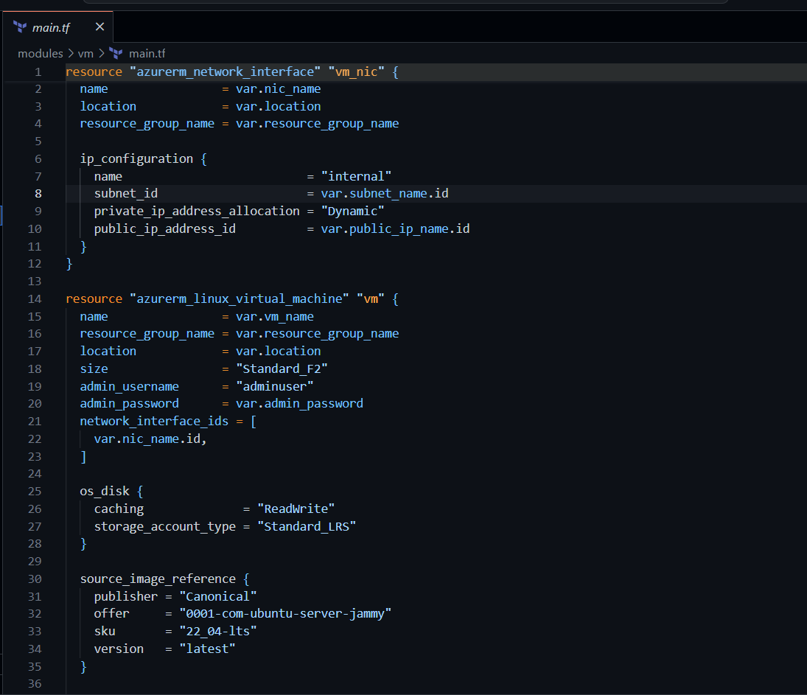
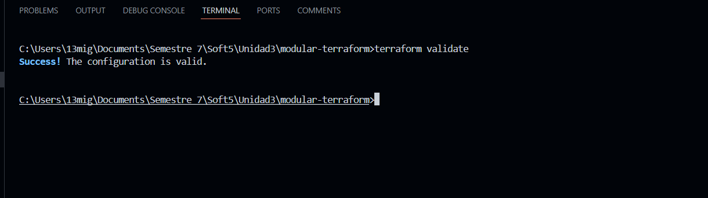

# **Terraform and Ansible Workshop Report**

**Miguel Gonzalez - A00395687**

## **Modularizing the project**

The modularization was done from the terraform configuration of the `terraform-vm-deploy` folder, leaving the folder structure as shown below:

Exploring the definition of the different `main.tf`:

1. Global main.tf:

   - The `provider` is declared.
   - The `resource_group` is declared where the rest of the elements are to be deployed.
   - We declare the `network` and `vm` modules that contain the rest of the elements.

2. Network main.tf:

   - The `virtualnetwork` is declared.
   - The `subnet` is declared.

3. VM main.tf:

   - The `network interface` for the VM is declared.
   - `Linux Virtual Machine` is defined.
   - Defines the `network security group` (NSG) for the VM.
   - `Association` between the network interface with the network security group.
   - Defines the `public IP` address for the VM.

Exploring the different `output.tf`:

1. VM output.tf:
   - Returns the `public id`

2. Network output.tf:
   - Return `subnet_id` required in the configuration of the vm module for use on the network interface.

## **Deploying with terraform**

- `terraform init`:

- `terraform validate`:

- `terraform plan`:

- `terraform apply`:

- Checking in azure:

## **Using Ansible**

This part use the code avaible in `https://github.com/ChristianFlor/training-ansible`. Ansible allow to execute playbooks to automate tasks on remote servers and is not compatible with windows, so this section will be done in a WSL console.

It's necessary have the sshpass library installed in the linux environment:

First, we need execute `ansible-playbook -i inventory/hosts.ini playbooks/install_docker.yml` where:

- `ansible-playbook`: Runs an Ansible playbook.
- `-i inventory/hosts.ini`: Specifies the inventory file (hosts.ini) located in the inventory/ directory. This file lists the target servers where the playbook will run.
- `playbooks/install_docker.yml`: This is the playbook being executed, located in the playbooks/ directory. It likely contains tasks to install Docker on the specified remote hosts.

Second, execute `ansible-playbook -i inventory/hosts.ini playbooks/run_container.yml`:

- `playbooks/run_container.yml`: This playbook likely contains tasks to run a Docker container on the remote hosts. It could be pulling an image, creating a container, or ensuring a service is running inside Docker.

We can check the container with `docker ps`. Now, we access the public url shown in azure along with the job we defined in the vm rules:

