# **Terraform Workshop**

Miguel Angel Gonzalez - A00395687

## **First part.**

This workshop was made based on the repository `https://github.com/ChristianFlor/azfunction-tf.git` in which the structure of the present code is explained in more detail. In addition, the subscription used was “educational”, so it was necessary to specify the subscription key as shown in the image below (it's possible consult it with `az account show`):

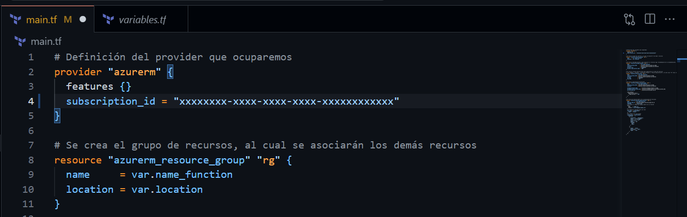

The objective in this part is to deploy an Azure function on the Azure platform. Below is a quick description of the `main.tf`:

- The Terraform provider to be used is defined, in this case `azurerm`, which allows to manage resources in Microsoft Azure. The `features {}` configuration is mandatory but can be left empty.

```hcl
provider "azurerm" {
  features {}
}
```

- A resource group (resource_group) is created, which will serve as a container for all other resources in the infrastructure. It is assigned a name and a location, defined through variables.

```hcl
resource "azurerm_resource_group" "rg" {
  name     = var.name_function
  location = var.location
}
```

- Azure recommends associating a storage account (storage_account) to the Function App. The service level is defined as “Standard” and replication as “LRS” (Locally Redundant Storage).

```hcl
resource "azurerm_storage_account" "sa" {
  name                     = var.name_function
  resource_group_name      = azurerm_resource_group.rg.name
  location                 = azurerm_resource_group.rg.location
  account_tier             = "Standard"
  account_replication_type = "LRS"
}
```

- The Service Plan (service_plan) defines the service level to be used by the Function App. In this case, plan Y1 represents the “Consumption” level, which allows for dynamic scaling.

```hcl
resource "azurerm_service_plan" "sp" {
  name                = var.name_function
  resource_group_name = azurerm_resource_group.rg.name
  location            = azurerm_resource_group.rg.location
  os_type             = "Windows"
  sku_name            = "Y1"
}
```

- A Windows function application (azurerm_windows_function_app) is defined. It is associated to the storage account and the Service Plan previously created. In addition, the execution environment is configured, in this case, Node.js version 18.

```hcl
resource "azurerm_windows_function_app" "wfa" {
  name                = var.name_function
  resource_group_name = azurerm_resource_group.rg.name
  location            = azurerm_resource_group.rg.location

  storage_account_name       = azurerm_storage_account.sa.name
  storage_account_access_key = azurerm_storage_account.sa.primary_access_key
  service_plan_id            = azurerm_service_plan.sp.id

  site_config {
    application_stack {
      node_version = "~18"
    }
  }
}
```

- A function (azurerm_function_app_function) is defined within the function application. The function is written in JavaScript and loads an index.js file with the function code.

```hcl
resource "azurerm_function_app_function" "faf" {
  name            = var.name_function
  function_app_id = azurerm_windows_function_app.wfa.id
  language        = "Javascript"

  file {
    name    = "index.js"
    content = file("example/index.js")
  }

  test_data = jsonencode({
    "name" = "Azure"
  })

  config_json = jsonencode({
    "bindings" : [
      {
        "authLevel" : "anonymous",
        "type" : "httpTrigger",
        "direction" : "in",
        "name" : "req",
        "methods" : [
          "get",
          "post"
        ]
      },
      {
        "type" : "http",
        "direction" : "out",
        "name" : "res"
      }
    ]
  })
}
```

---

Passing the use of terraform for deployment. First, the working directory is initialized with the terraform configuration using `terraform init`, this downloads the necessary providers and configures the backend to store the state:

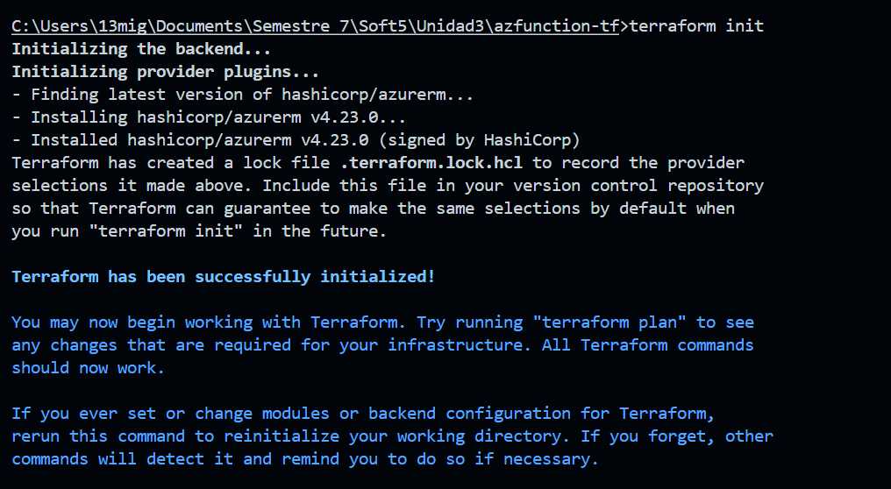

It is verified if the configuration is syntactically valid and that the references to resources and providers are correct with `terraform validate`:

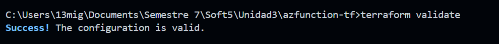

The `terraform plan` is used to show a preview of the changes that will be applied to the infrastructure, allowing you to review which resources will be created, modified or deleted without executing the changes:

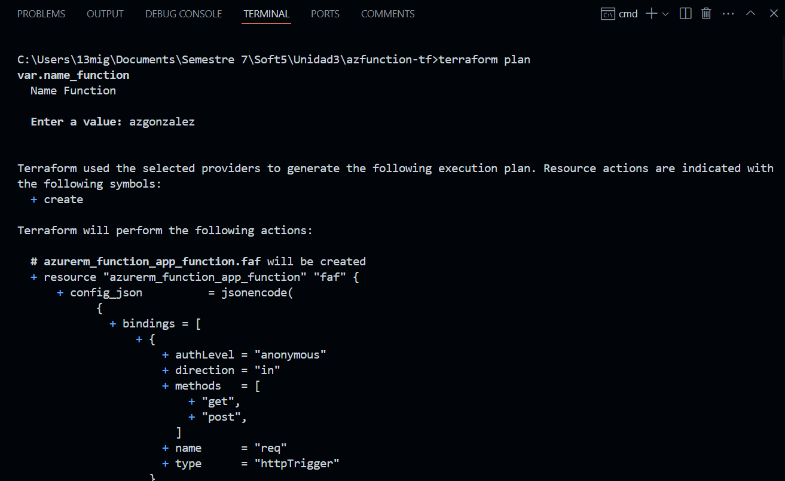

Finally the changes defined in the configuration are applied. Creates, modifies or deletes resources as determined by `terraform plan`.

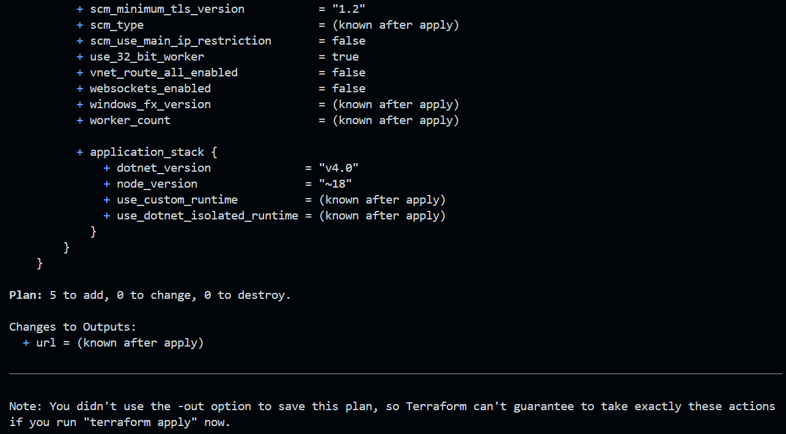

If we go to the azure platform, we will be able to see the resources we set in the file created:

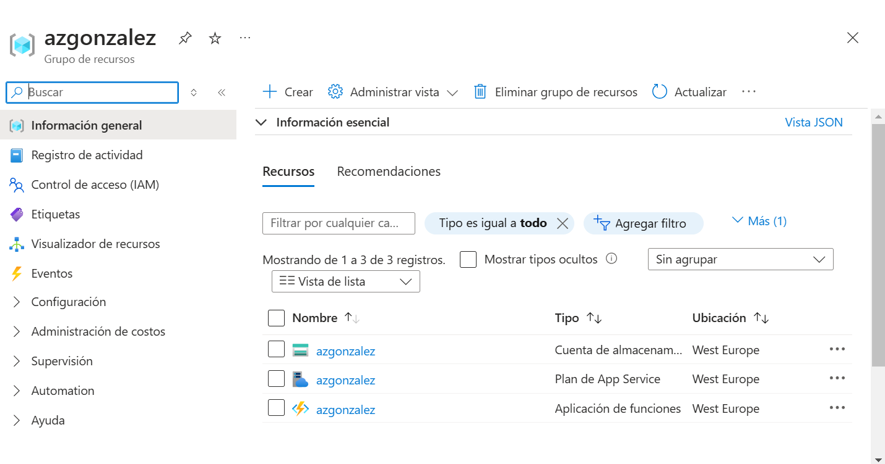

We go to the function and click on the url provided by azure:

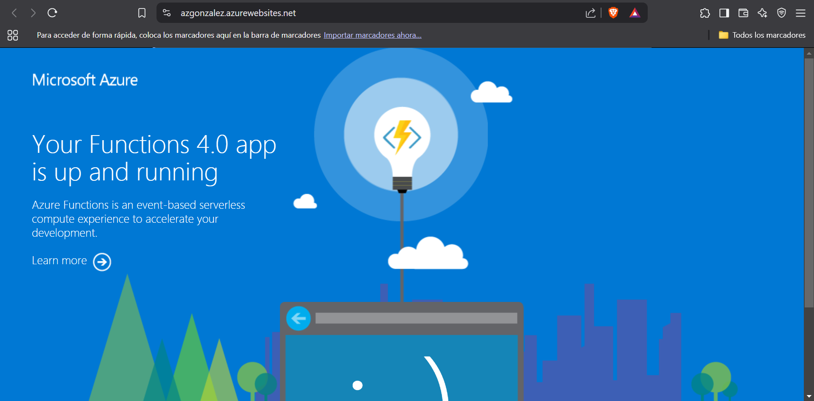

Para ver nuestra funcion en accion, agregamos a la url `/api/functionName`:

## 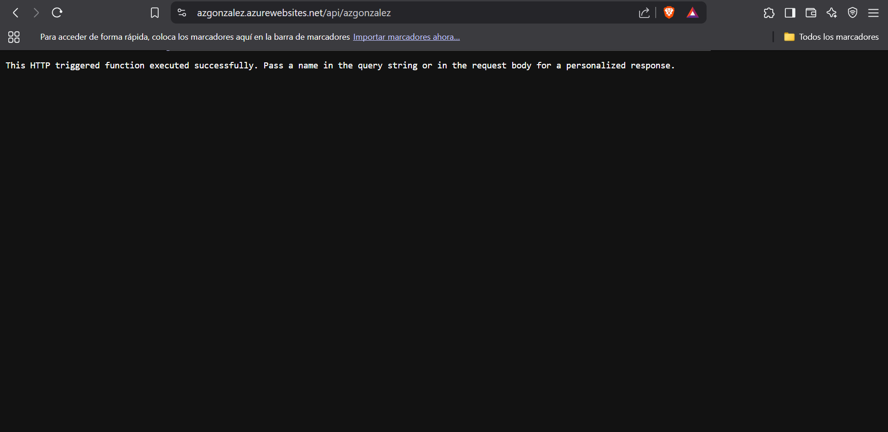

## **Second part.**

Now the goal is to use terrafom to deploy a Linux virtual machine in azure. Thus we have these definitions in the `main.tf`:

- The terraform provider:

```hcl
provider "azurerm" {
  features {}
}
```

- A resource group:

```hcl
resource "azurerm_resource_group" "myfirstvmrg" {
  name     = "myfirstvmrg"
  location = "West Europe"
}
```

- A virtual network (`azurerm_virtual_network`) is defined, which will serve as the basis for the network infrastructure within Azure. The network has an address space of `10.0.0.0.0/16`.

```hcl
resource "azurerm_virtual_network" "myfirstvmvnet" {
  name                = "myfirstvmvnet"
  address_space       = ["10.0.0.0/16"]
  location            = azurerm_resource_group.myfirstvmrg.location
  resource_group_name = azurerm_resource_group.myfirstvmrg.name
}
```

- A subnet (azurerm_subnet) is defined within the previously created virtual network. The subnet has an address space of `10.0.2.0/24`:

```hcl
resource "azurerm_subnet" "myfirstvmsubnet" {
  name                 = "myfirstvmsubnet"
  resource_group_name  = azurerm_resource_group.myfirstvmrg.name
  virtual_network_name = azurerm_virtual_network.myfirstvmvnet.name
  address_prefixes     = ["10.0.2.0/24"]
}
```

- A network interface (azurerm_network_interface) is created and associated to the virtual machine. A dynamic IP configuration is defined and a public IP is associated.

```hcl
resource "azurerm_network_interface" "myfirstvmnic" {
  name                = "myfirstvmnic"
  location            = azurerm_resource_group.myfirstvmrg.location
  resource_group_name = azurerm_resource_group.myfirstvmrg.name

  ip_configuration {
    name                          = "internal"
    subnet_id                     = azurerm_subnet.myfirstvmsubnet.id
    private_ip_address_allocation = "Dynamic"
    public_ip_address_id          = azurerm_public_ip.myfirstvmpublicip.id
  }
}
```

A Linux virtual machine (`azurerm_linux_virtual_machine`) is defined. It is configured with a `Standard_F2` size, access credentials and the previously created network interface is associated:

```hcl
resource "azurerm_linux_virtual_machine" "myfirstvm" {
  name                = "myfirstvm"
  resource_group_name = azurerm_resource_group.myfirstvmrg.name
  location            = azurerm_resource_group.myfirstvmrg.location
  size                = "Standard_F2"
  admin_username      = "adminuser"
  admin_password      = "Password1234!"
  network_interface_ids = [
    azurerm_network_interface.myfirstvmnic.id,
  ]

  os_disk {
    caching              = "ReadWrite"
    storage_account_type = "Standard_LRS"
  }

  source_image_reference {
    publisher = "Canonical"
    offer     = "0001-com-ubuntu-server-jammy"
    sku       = "22_04-lts"
    version   = "latest"
  }

  disable_password_authentication = false
  provision_vm_agent              = true
}
```

- A network security group (`azurerm_network_security_group`) is defined, which will control the virtual machine traffic. A security rule is created to allow SSH traffic (port 22):

```hcl
resource "azurerm_network_security_group" "myfirstvmnsg" {
  name                = "myfirstvmnsg"
  location            = azurerm_resource_group.myfirstvmrg.location
  resource_group_name = azurerm_resource_group.myfirstvmrg.name

  security_rule {
    name                       = "ssh_rule"
    priority                   = 100
    direction                  = "Inbound"
    access                     = "Allow"
    protocol                   = "Tcp"
    source_port_range          = "*"
    destination_port_range     = "22"
    source_address_prefix      = "*"
    destination_address_prefix = "*"
  }
}
```

- The network security group (`azurerm_network_security_group`) is associated to the network interface of the virtual machine.

```hcl
resource "azurerm_network_interface_security_group_association" "myfirstvmcnicnsg" {
  network_interface_id      = azurerm_network_interface.myfirstvmnic.id
  network_security_group_id = azurerm_network_security_group.myfirstvmnsg.id
}
```

A public IP address (`azurerm_public_ip`) with static assignment is defined, which will allow remote access to the virtual machine:

```hcl
resource "azurerm_public_ip" "myfirstvmpublicip" {
  name                = "myfirstvmpublicip"
  location            = azurerm_resource_group.myfirstvmrg.location
  resource_group_name = azurerm_resource_group.myfirstvmrg.name
  allocation_method   = "Static"
}
```

---

The same execution steps are followed as in the first part. `terraform init`:

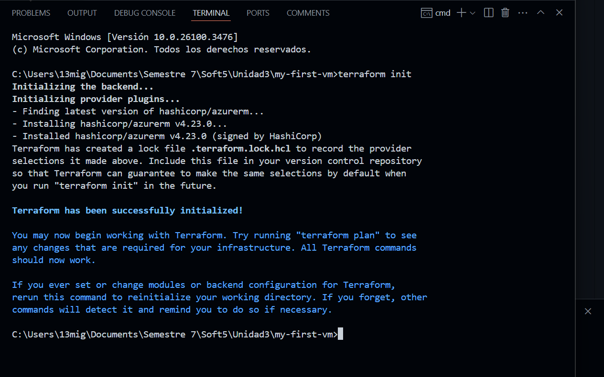

`terraform validate`:

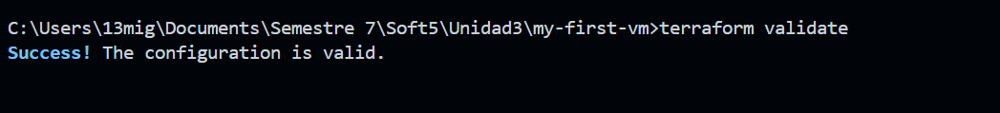

`terraform plan`:

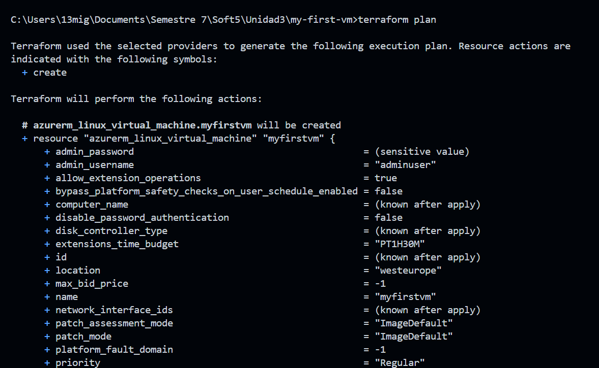

`terraform apply`:

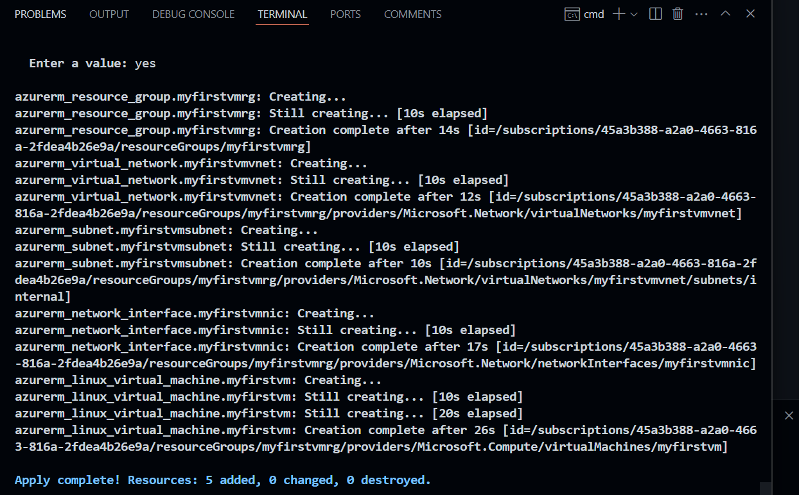

Azure validation:

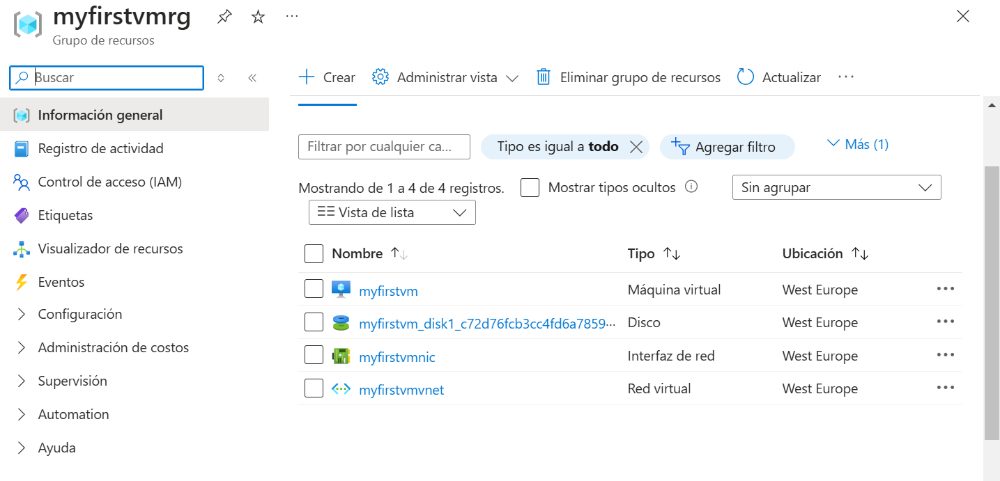

Console validation using public ip:

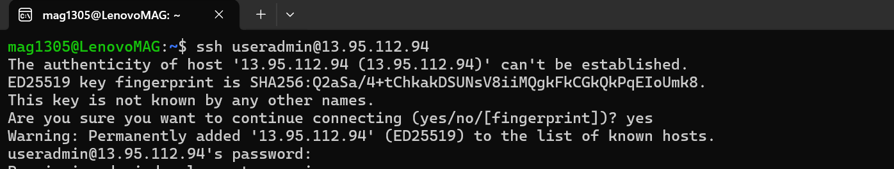

`terraform destroy`:

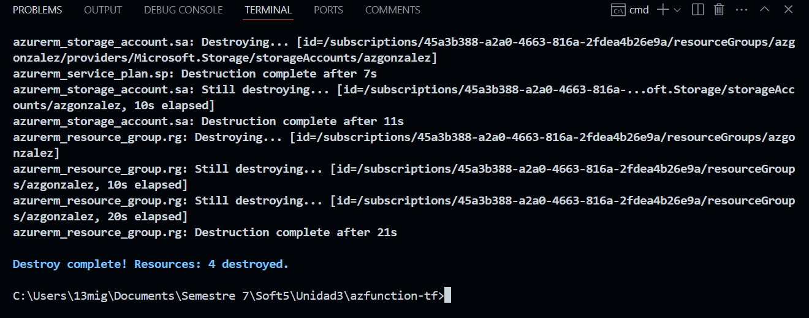
